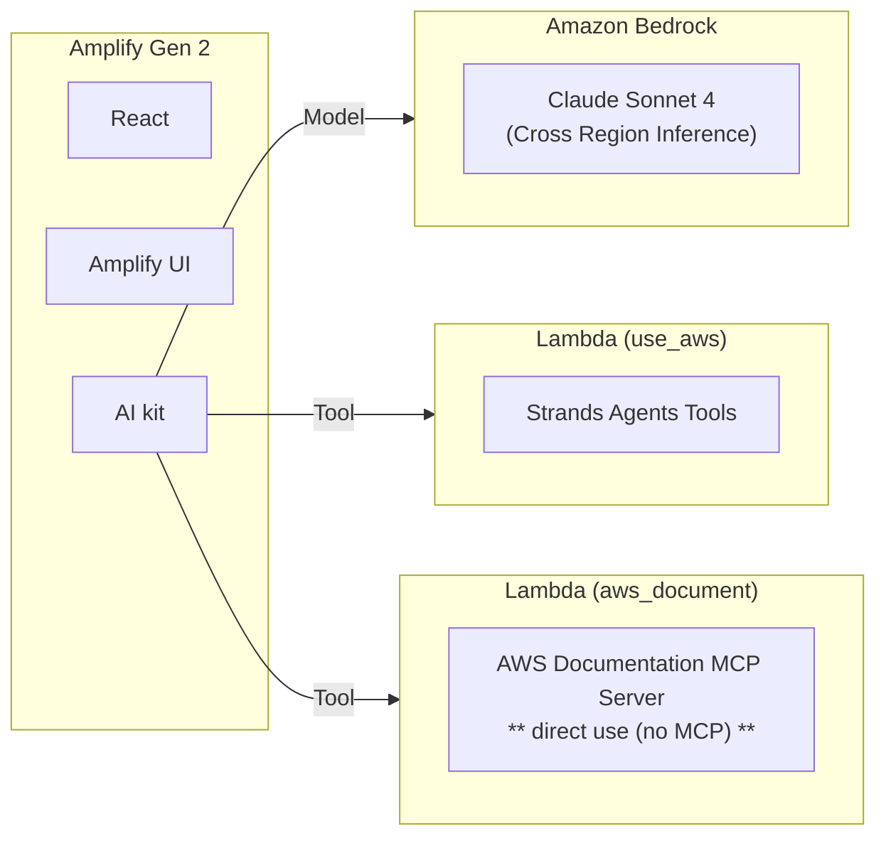

# Chat with your Workload

## Component Architecture

```mermaid
flowchart LR
    subgraph AmplifyGen2["Amplify Gen 2"]
        React["React"]
        AmplifyUI["Amplify UI"]
        AIKit["AI kit"]
    end

    subgraph AmazonBedrock["Amazon Bedrock"]
        Claude["Claude Sonnet 4<br>(Cross Region Inference)"]
    end

    subgraph AWSLambda1["Lambda (use_aws)"]
        StrandsAgents["Strands Agents Tools"]
    end

    subgraph AWSLambda2["Lambda (aws_document)"]
        AwsDocumentation["AWS Documentation MCP Server<br>** direct use (no MCP) **"]
    end

    AIKit -- Model --> AmazonBedrock
    AIKit -- Tool --> AWSLambda1
    AIKit -- Tool --> AWSLambda2
```
